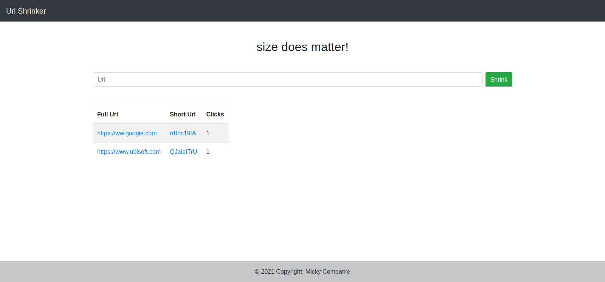
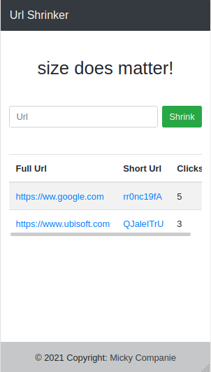

# UrlShrinker

Here's a simple url shortener i made to descover some tech that i never used before

## Tech used

- node.js
- express.js
- mongodb

## What it looks like

- on pc    
    

- on smartphone    
    

## Other

if you want to test it by yourself you'll need to [install mongodb](https://docs.mongodb.com/manual/installation/) and start it on your machine